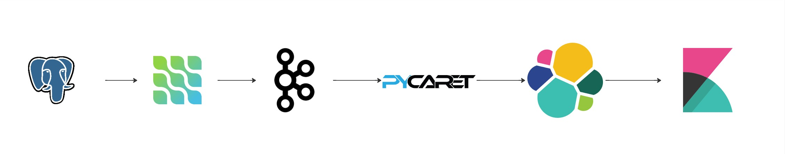

# Detecção de Fraudes em Transações Financeiras em Tempo Real

    

Este projeto tem como objetivo detectar transações fraudulentas em tempo real utilizando um pipeline de dados que envolve PostgreSQL, Debezium, Apache Kafka, PyCaret (Machine Learning), Elasticsearch e Kibana.

## 📋 Tabela de Conteúdos

- [Visão Geral](#visão-geral)
- [Funcionalidades](#funcionalidades)
- [Tecnologias Utilizadas](#tecnologias-utilizadas)
- [Etapas do Projeto](#etapas-do-projeto)
- [Instalação e Configuração](#instalação-e-configuração)
- [Uso](#uso)

## 🌟 Visão Geral

O sistema é composto por um pipeline de dados que:
1. Captura mudanças em um banco de dados PostgreSQL usando **Debezium** (Change Data Capture - CDC).
2. Envia os dados para um tópico no **Apache Kafka**.
3. Consome os dados com um modelo de Machine Learning treinado com **PyCaret** para prever fraudes.
4. Envia as previsões (transações aprovadas ou fraudulentas) para outro tópico no Kafka.
5. Armazena os dados no **Elasticsearch** e visualiza os resultados em um dashboard no **Kibana**.

## ✨ Funcionalidades

- **Detecção em Tempo Real**: Identifica transações fraudulentas instantaneamente.
- **Pipeline de Dados Integrado**: Utiliza tecnologias modernas para processamento de dados em tempo real.
- **Dashboard de Monitoramento**: Visualizações em tempo real das transações aprovadas e fraudulentas.

## 🛠 Tecnologias Utilizadas

- **PostgreSQL**: Banco de dados transacional.
- **Debezium**: Captura de mudanças no banco de dados (CDC).
- **Apache Kafka**: Sistema de mensageria para streaming de dados.
- **PyCaret**: Biblioteca de Machine Learning para treinamento e previsão.
- **Elasticsearch**: Armazenamento e indexação de dados.
- **Kibana**: Visualização e monitoramento dos dados.
- **Python**: Linguagem principal para scripts e modelo de Machine Learning.

## 🚀 Etapas do Projeto

1. **Criação do Modelo de Previsão**:
   - Utilizar o PyCaret para treinar um modelo de Machine Learning com dados históricos de transações.
   - Exportar o modelo treinado para uso no pipeline.

2. **Configuração do PostgreSQL e Carga de Dados**:
   - Configurar o banco de dados PostgreSQL.
   - Criar um script para carregar dados de transações no banco.

3. **Configuração do Debezium e Kafka**:
   - Configurar o Debezium para capturar mudanças no PostgreSQL.
   - Enviar os dados capturados para um tópico no Kafka.

4. **Integração do Modelo com Kafka**:
   - Consumir os dados do tópico Kafka com o modelo de Machine Learning.
   - Enviar as previsões (aprovado/fraudulento) para outro tópico no Kafka.

5. **Configuração do Elasticsearch e Kibana**:
   - Configurar o Elasticsearch para armazenar as previsões.
   - Criar um dashboard no Kibana para visualizar as transações aprovadas e fraudulentas.

## 🛠️ Instalação e Configuração

### Pré-requisitos

- Docker e Docker Compose (para facilitar a configuração dos serviços).
- Python 3.8+.

## 🚀 Uso
Após a configuração, o sistema estará pronto para:

Capturar transações em tempo real.

Classificar as transações como aprovadas ou fraudulentas.

Visualizar os resultados no Kibana.